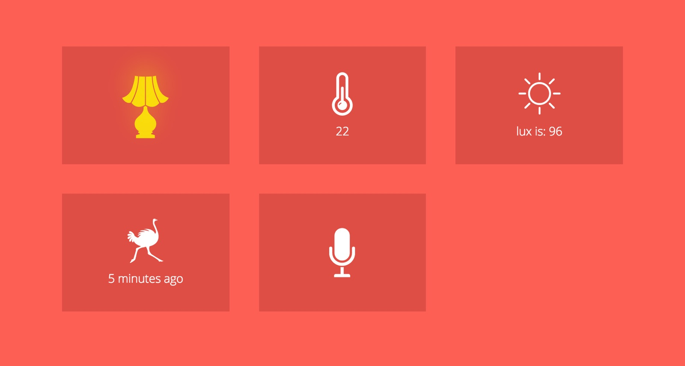

Koti Home
========



Koti Home (the name comes from the Finnish word “koti” that means “home”) is a home automation system based on Arduino that I’ve built. See it [in action](http://youtu.be/p0GO6ct6n94). I’ve writte a post about this project: http://arturpaikin.com/en/home-automation-experiments/ and also gave a talk at Queens.js, check out the [slides](http://bit.ly/notonfire) and [video](https://youtu.be/Z-NpPj6aKJE).

:warning: __The code is a little outdated, Webpack config should be fixed, JavaScript fatigue.__

Right now supports the following features:

* Showing home temperature (in Celsius)
* Email notifications (or text message with the help of [IFTTT](https://ifttt.com)) if movement occurred
* Switching the light on and off remotely (might be any electronic device)
* Voice commands like “turn the light on” and “status update” and “make me coffee”

Koti Home is ran by a Node.js app on a server (mine is at [DigitalOcean VPS](https://www.digitalocean.com/?refcode=054bb617bf5e)), Arduino connected to a Raspberry Pi with a Node.js client app and Arduino with a couple of sensors.  

## Usage

1. Get an Arduino and all the necessary sensors. I have a temperature, light, relay and motion. Connect everything.
2. Clone this repository, rename ```example_config.json``` to ```config.json``` and change all the credentials, like email and passwords.
3. Upload the ```Arduino/koti.ino``` to Arduino board and set up the ```koti.js``` app on your server. I recommend [PM2](https://github.com/Unitech/pm2).
4. Buy a huge chair, a desk and a Darth Vader mask. Make a Margarita and control ~~the planet~~ your house.
Disclaimer: chair, desk, mask and Margarita are sold separately.
